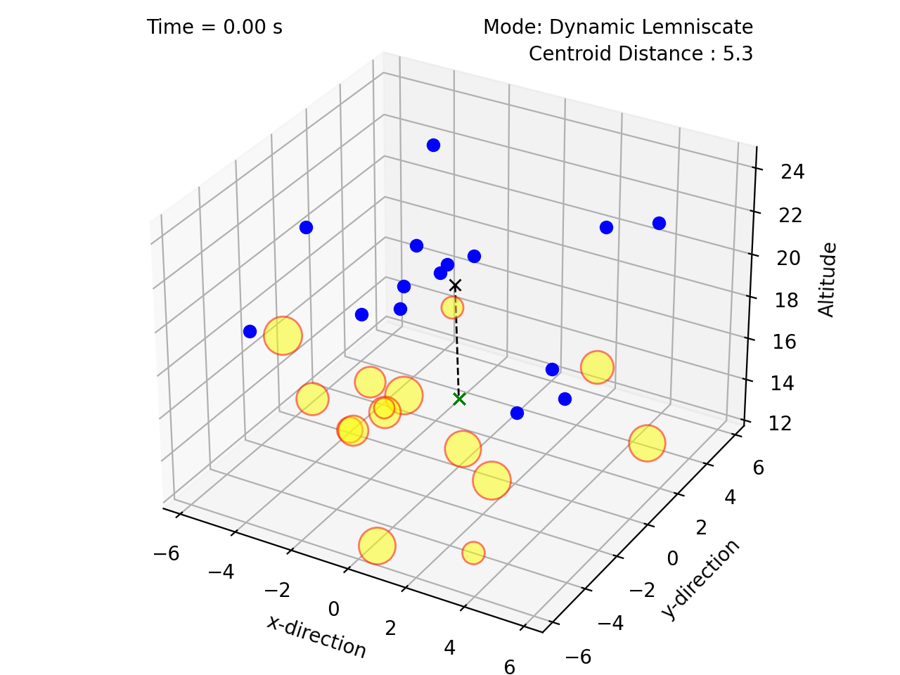
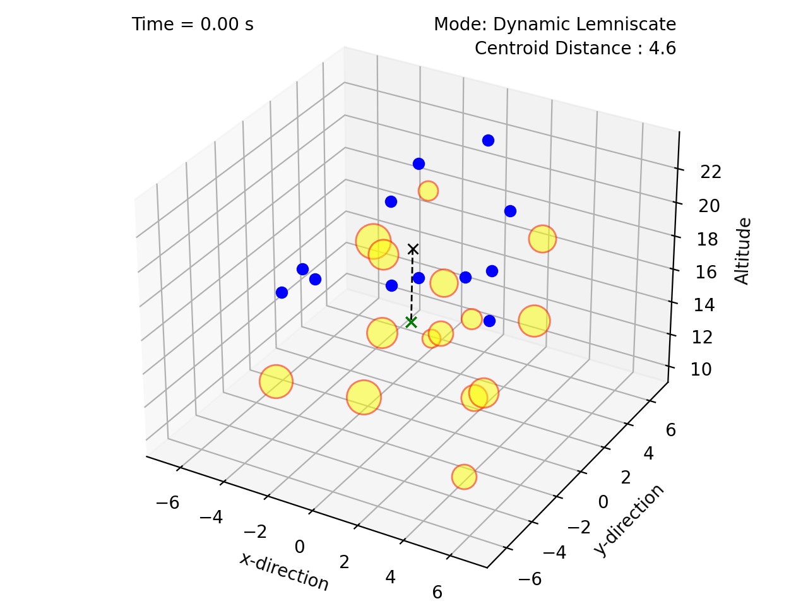
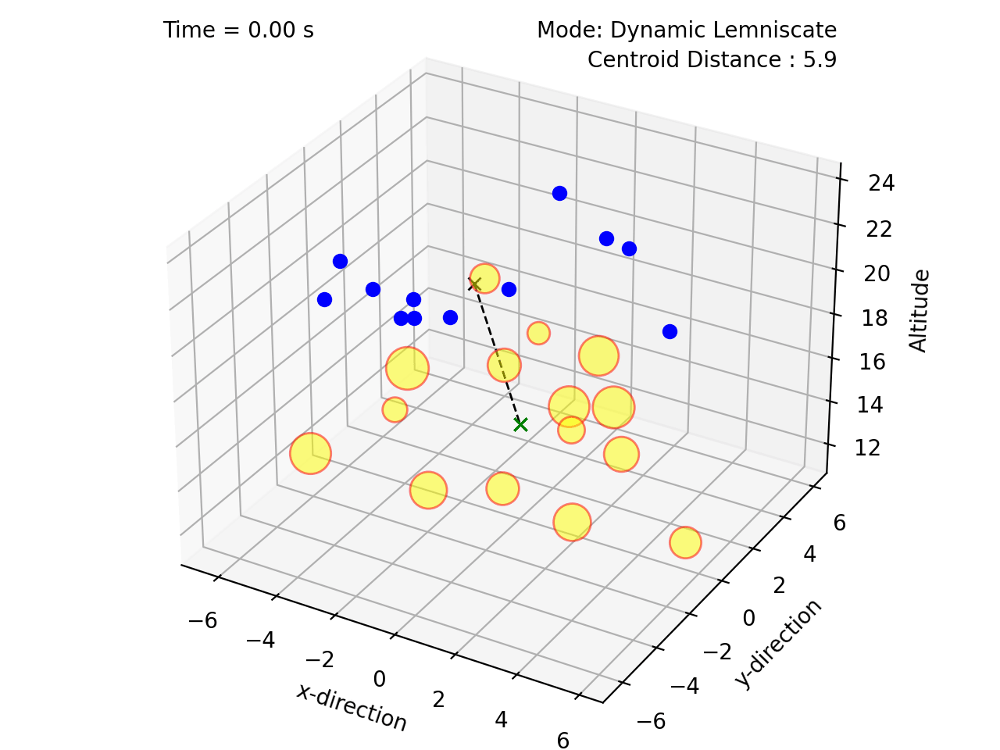

(private repo)

# New paper TBD

New paper

# Plots



    



Lemniscate of Bernoulli:


    


Dumbbell Curve:


    


Gerono curve with phase shift


    



# Citing

The code is opensource but, if you reference this work in your own reserach, please cite me. I have provided an example bibtex citation below:

`@techreport{Jardine-2023,
  title={insert new paper name},
  author={Jardine, P.T.},
  year={2023},
  institution={Royal Military College of Canada, Kingston, Ontario},
  type={GitHub Repository},
}`

Alternatively, you can cite any of my related papers, which are listed in [Google Scholar](https://scholar.google.com/citations?hl=en&user=RGlv4ZUAAAAJ&view_op=list_works&sortby=pubdate).















 

